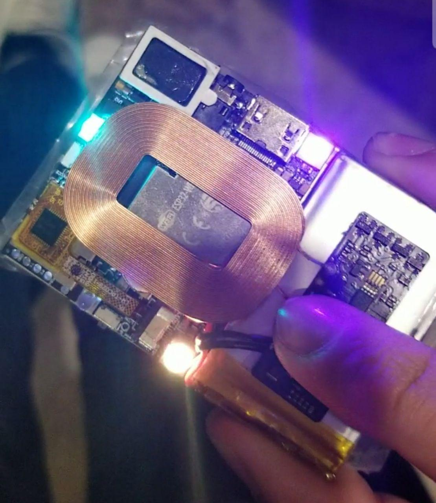

# I/ON32 Smartwatch

  

The I/ON32 is a smartwatch designed around the [ESP32](https://en.wikipedia.org/wiki/ESP32). I/ON32 is a smart multipurpose IoT device running [micropython](https://Micropython.org). It can also compatible with the [Arduino](https://www.arduino.cc/) platform through the [IDE](https://www.arduino.cc/en/software). 

## Features
- **Touch Display:** 2.4" RGB Display at 240x320 resolution. 
- **SD Card:** Micro SD card with support to up 32GB in capacity for applications, music, data storage, and more.
- **Haptic Feedback:** Shaftless vibration motor, up to 14500 RPM.
- **Gyroscope:** 3-axis gyroscope. Used to for detecting inclination and orientation.
- **Accelerometer:** 3-axis accelerometer. Used for collision and movement detection. Good for VR and AR integration.
- **Magnetometer:** 3-axis magnetometer. Used as an internal compass for orientation.
- **Barometer:** Environmental sensor with temperature, barometric pressure with ±1 meter accuracy. Used to determine current height.
- **Air Quality Sensor:** To measure air quality for personal wellbeing the gas sensor within the BME680 can detect a broad range of gases such as volatile organic compounds (VOC).
- **Humidity Sensor:** Used for detecting relative humidity.
- **Temperature Sensors Array:** Multiple sensors inside the device to detect CPU and ambient temperature.
- **Pulse Oximeter:** High-Sensitivity Pulse Oximeter and Heart-Rate Biosensor for Fitness & Healthcare.
- **Real Time Clock:** Real-time clock (RTC) with alarm functions and backup battery.
- **Addressable RGBW LEDs:** Addressable RGBW LEDs for notifications and lighting.
- **Voltage/Current Sensor:** Used to detect current usage when running applicaitons and voltage level from the lipo battery.
- **IR Transmitter:** Transmits IR signals which can control televisions, AC, speakers, etc.
- **3 Programmable Buttons:** Used to control volume, load apps, turn the device on and off, etc.
- **Microphone:** Used for phone class, voice memos, etc.
- **Speaker and Amp:** Used for internet radio, phone calls, music player, video player, etc.
- **Light Sensor:** Used for automatic brightness control.
- **Modular Port:** Connect to other devices as a primary or secondary device.
- **WiFi:** ESP32 counts with a 802.11 b/g/n WiFi connectivity that can be used in access point or station mode
- **Bluetooth:** ESP counts with a 4.2v BR/EDR and BLE chip.
- **CAN Bus:** Can be used to connect to vihecles that count with this standars.
- **Battery:** 1000mAh with over charge, short, and over discharge protections. 

